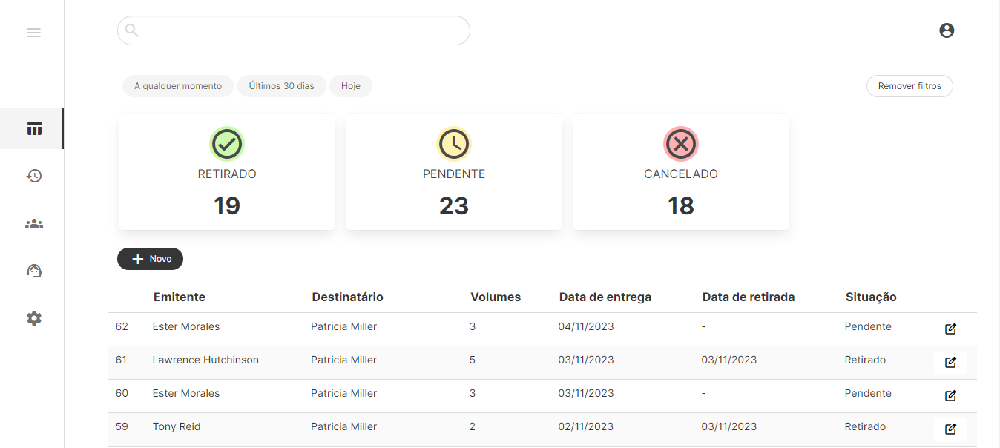

# Centro de Distribuição

O Centro de Distribuição é um programa web para controle de entrada e saída de pacotes.
Cadastre usuários, remetentes e destinatarios, e faça o controle dos pacotes entregues e retirados da sua loja, distribuidora ou setor.



Atravez do CD você poderá:

- Incluir protocolos
- Retirar protocolos
- Tirar relatórios de entrada e saída

Tudo isso de forma simples e gráfica para facilitar o seu trabalho.
Vamos começar?

## Para rodar localmente

1. Crie um ambiente virtual

    ``` shell
    python -m venv venv
    ```

2. Ative-o

    ``` shell
    venv\Scripts\activate      //Windows
    source venv/bin/activate   //Linux
    ```

3. Instale as dependências do projeto

    ``` shell
    pip install -r requirements.txt
    ```

4. Configure um arquivo mysql.cnf com as informações do seu banco de dados local

    ``` shell
    [client]
    database = your_database
    host = localhost
    user = your_user
    password = your_password
    default-character-set = utf8
    ```

5. Faças as migrações

    ```shell
    python manage.py makemigrations
    python manage.py migrate
    ```

6. Rode \o/

    ``` shell
    python manage.py runserver
    ```

### Tecnologias utilizadas: Django, MySQL, Bulma e JQuery
